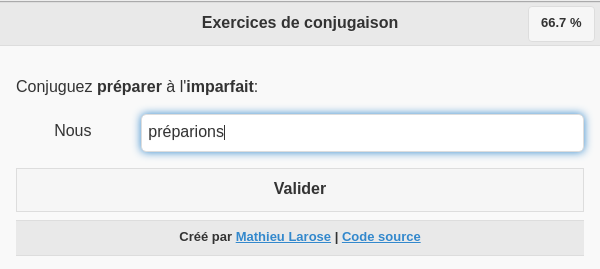
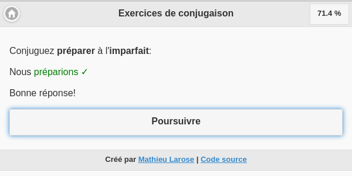
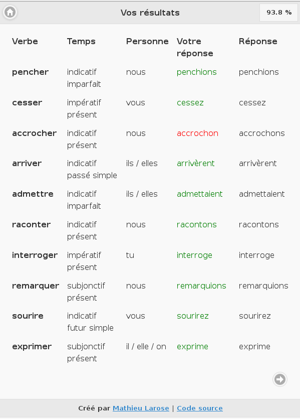

# Verbes

Verbes is a French verb conjugation trainer.








# Development Environment

## Quick Start

### Create a network for the database container and app container

```
$ make create-network
```

### Create the database image

```
$ make build-postgres
```

### Start the database

```
$ make start-postgres
```

### Create initial data

```
$ make docker-run CMD=bash
# The following commands must be run in the app container
$ make migrate
$ make createsuperuser
$ make load-tenses load-most-frequent-verbs
$ exit
```

### Start the app

```
$ make docker-run
```


# Author

Mathieu Larose <mathieu@mathieularose.com>
